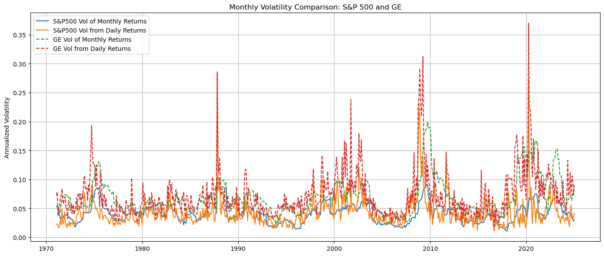

# Market volatility forecasting with AR and GARCH

I built this project to study and forecast equity volatility with classical time series models. I organized the work as a small package with a script that reproduces data preparation, model estimation, rolling forecasts, and evaluation.

## What I did

1. I implemented a data loader that reads local csv files or downloads public prices when needed
2. I converted close prices to log returns and aggregated them at daily weekly and monthly levels
3. I estimated AR 1 GARCH 1 1 and GJR GARCH 1 1 on returns
4. I produced rolling one step ahead forecasts with a sliding window
5. I evaluated forecasts with RMSE and MAE and saved figures and metrics to the reports folder

## Quick start

1. Create a virtual environment
2. Install the package from the repo root
   pip install .
3. Place csv files in the data folder with columns
   date in format YYYY MM DD
   price as adjusted close
4. Run the pipeline
   python scripts/run_all.py
5. Review plots and metrics in the reports folder

## Data

I used SPY as a proxy for the index and GE as an individual name for examples. If local files are missing the loader can fetch public daily prices. You can change tickers in the script or in src vol_forecast data.py

## Methods

1. Compute log returns in percent
2. Fit AR 1 on realized volatility
3. Fit GARCH 1 1 and GJR GARCH 1 1 on returns
4. Generate rolling forecasts
5. Score with RMSE and MAE

## Selected results

I saved example figures so results are visible without running the code.

## Project layout

repo root  
src/vol_forecast/__init__.py  
src/vol_forecast/data.py  
src/vol_forecast/modeling.py  
src/vol_forecast/evaluate.py  
src/vol_forecast/plotting.py  
scripts/run_all.py  
notebooks/volatility_forecasting_walkthrough.ipynb  
notebooks/archive/berkeley_original_ps6_solution.ipynb  
reports/figures/figure_01.png  
reports/figures/figure_02.png  
reports/figures/figure_03.png  
reports/figures/figure_04.png  
reports/figures/figure_05.png  
reports/figures/figure_06.png  
reports/figures/figure_07.png  
reports/summary.md  
data/README.md  
tests/test_smoke.py  
README.md  
pyproject.toml  
.gitignore  
LICENSE

## Notes

I kept my original Berkeley notebook in an archive folder for provenance while the main notebook demonstrates the clean pipeline. The code is modular and can be extended to new tickers or additional volatility models.
